<!--more-->

### 看起来成品似乎还不错


#### 布局


改造后的header需要考虑到以下几个因素：

1. 三个组件部分整合到一起时它们各自的宽度要足够充分；
2. 组件宽度是自适应的；
3. 每个组件需要三分之一的可利用空间宽度，当然中间的LCD部分需要比两头宽。

于是乎，先写一个基本的html：

```html
<div class="c-playback">
     <div class="c-playback__controls">Playback controls</div>
     <div class="c-playback__lcd">Playback LCD</div>
     <div class="c-playback__user">User Area</div>
</div>
```


#### CSS Flexbox

```css
.c-playback__controls,
.c-playback__user {
    flex-grow: 1;
}

.c-playback__lcd {
    flex-grow: 2;
}
```

LCD组件部分的CSS是```flex-grow: 2```：

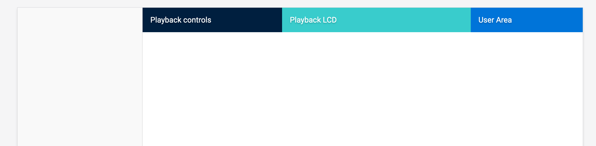

看起来似乎还不错，但这不是最好的解决方案，如果采用CSS Grid的方案我可以做得更好，因为调整每个html内部中的column以及它们之间添加间隙会轻松不少。

#### CSS Grid

首先按照比例对三个区域进行划分：

```css
.c-playback {
    display: grid;
    grid-template-columns: 30% 40% 30%;
}
```

区域之间添加```10px```间隙：

```css
.c-playback {
    display: grid;
    grid-template-columns: 30% 40% 30%;
    grid-gap: 10px;
}
```

看上去由内味儿了：


当然这里面有个疑问是使用百分比宽度会变成了这样，如果这样总宽度就会按照各个column宽度的百分比增加。也就是说```.c-playback```的宽度变成了100px + 20px，于是出现了横向的滑动条。

于是这里使用CSS函数```calc()```，很好理解，百分比宽度减去固定宽度值:

```css
.c-playback {
    display: grid;
    grid-template-columns: calc(30% - 10px) 40% calc(30% - 10px);
    grid-gap: 10px;
}
```

但是这种解决方案并不是一劳永逸的，我们尽可能地希望以百分比的方式解决问题，所以我们这里使用CSS Grid的属性```fr```来实现：

```css
.c-playback {
    display: grid;
    grid-template-columns: 1fr 1.5fr 1fr;
    grid-gap: 10px;
}
```

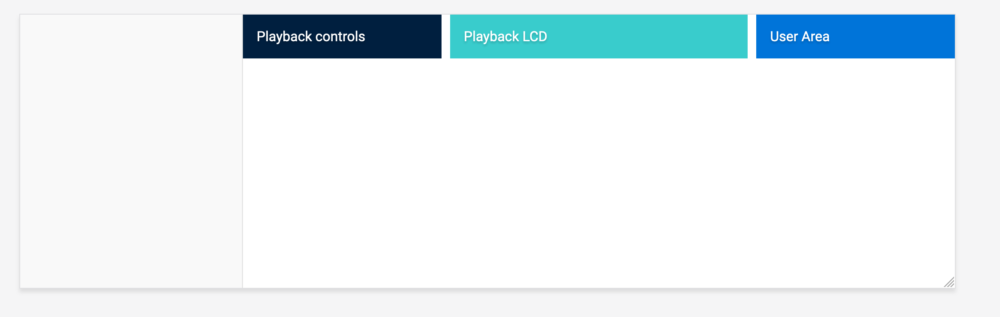

#### 大屏

假设我们的网站设计需要在大屏显示上展示，但是我们测试时显示器就那么大，可怎么办？简单一点，可以用```ctrl+-```来模拟网站放大后局部组件的效果。这里放大到大概2200px试试：


你是不是觉得这种方式有点low逼，那我们干脆锁定最大显示宽度好了，从而保持容器组件居中：

```css
.c-playback {
    /*Other styles*/
    max-width: 1500px;
    margin-left: auto;
    margin-right: auto;
}
```

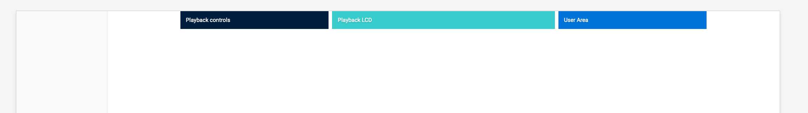

还可以吧。

### 播放器按钮


先直接上代码搭起来：

```html
<div class="c-playback__controls">
    <button class="c-playback__control">
        <!--SVG-->
    </button>
    <div class="c-playback__controls__group">
        <button class="c-playback__control">
            <!--SVG-->
        </button>
        <button class="c-playback__control">
            <!--SVG-->
        </button>
        <button class="c-playback__control">
            <!--SVG-->
        </button>
    </div>
    <button class="c-playback__control">
        <!--SVG-->
    </button>
</div>
```

这里我们已经准备好了相关的UI组件，切图仔来了：

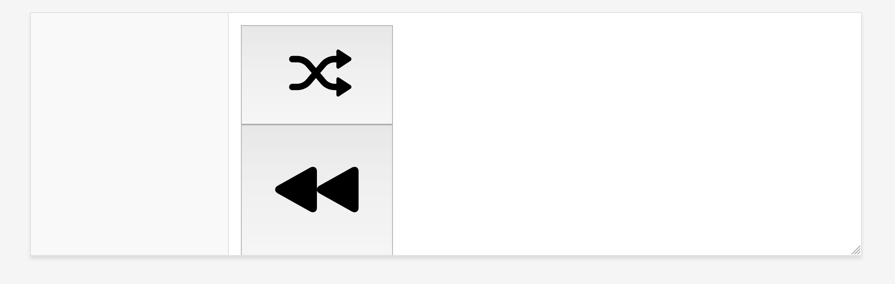

首先先确定每个图标的宽度：

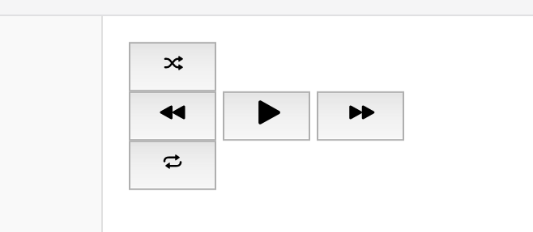

在此之前要重置```button```容器的CSS：

```css
.c-playback__controls button {
    appearance: none;
    border: 0;
    background: transparent;
    padding: 0;
}
```

然后利用CSS Grid的方式布局按钮：

```css
.c-playback__controls {
    display: grid;
    grid-template-columns: 1fr auto 1fr;
}
```

如果不是太苛求组件的宽度，中间组件```auto```来自适应：

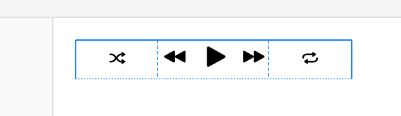

或许随机播放和重复播放按钮不大对，让切图仔帮你重新切个，或者自己调整组件高宽：

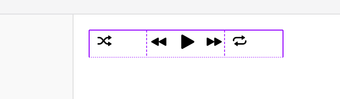

但是调整之后，各个组件的排列（align）并不一定完全正确，这里需要进行调整：

```css
.c-playback__controls {
    display: grid;
    grid-template-columns: 1fr auto 1fr;
    justify-items: center;
    align-items: center;
}
```

然后再对中间播放按钮部分适当放大：


但是左右的随机播放和重复播放隔得有点远：

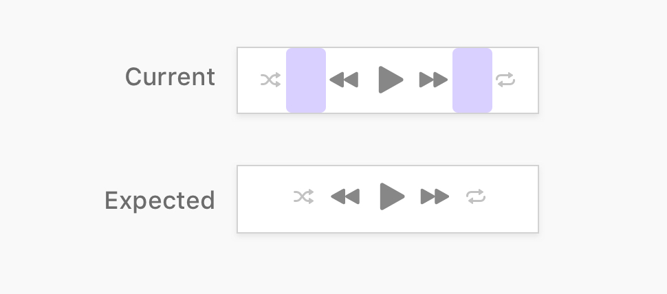

这里我们需要对原有得架构作出如下改进：

1. 内部的按钮组件拆分成不同得元素；
2. 使用```display: inline-grid```，而不是```display: grid```;
3. 使用```text-align: center```属性。

```html
<div class="c-playback__controls">
    <!-- Inner wrapper -->
    <div class="c-playback__controls__wrapper">
        <!-- Playback buttons -->
    </div>
</div>
```

```css
.c-playback__controls__wrapper {
    text-align: center;
}

.c-playback__controls {
    display: inline-grid;
    grid-template-columns: 1fr auto 1fr;
    justify-items: center;
    align-items: center;
}
```


#### Inline Grid的工作原理

```.c-playback__controls```以Grid的方式布局时会以父元素的宽度为基准，因此作为子元素会占满父元素的宽度。

但是Inline Grid会让元素相对于其父元素始终保持一行，当元素拥有```display:inline-grid```属性的时候，可以通过添加```text-align```的方式让元素居中：

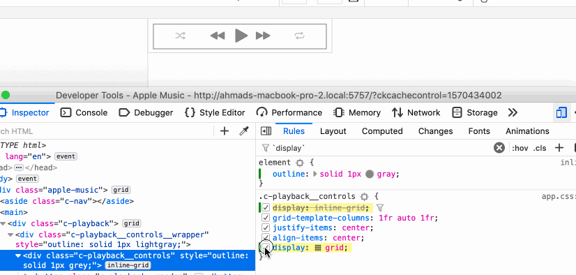


### 播放控件LCD


该组件有两部分组成：音乐图标和居中的苹果图标：

```html
<div class="c-playback__lcd">
    <!-- SVG Icon -->
</div>
```

```css
.c-playback__lcd {
    position: relative;
    height: 44px;
    border: 0.5px solid #dedede;
    border-radius: 3px;
    overflow: hidden;
    text-align: center;
    /* Flexbox for centering the SVG */
    display: flex;
    justify-content: center;
    align-items: center;
}

.c-playback__lcd:before {
    content: "";
    position: absolute;
    left: 0;
    top: 0;
    width: 44px;
    height: 44px;
    background: url('...') center/100% no-repeat;
}
```

这里我采用了Flexbox让苹果居中，最终产物如下：

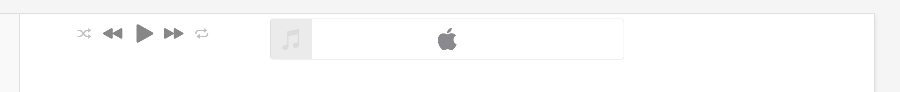

### 用户操作

无非涉及三个功能：音量、歌曲切换以及登录：

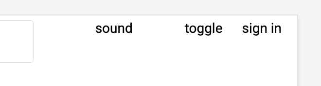

#### 音量键

这里涉及两个部分：音量的图标以及音量控制拖动：

```html
<div class="c-slider-input">
    <svg>..</svg>
    <input type="range" name="" id="" value="0">
</div>
```

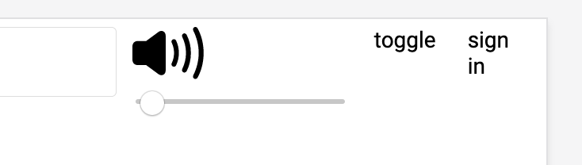

这里需要改进的是：图标的大小以及两个图标组件需要排成一行。

```css
.c-input-slider {
    display: flex;
    align-items: center;

    input {
        width: 70px;
    }

    svg {
        width: 16px;
        height: 16px;
        fill: #999;
    }
}
```

这里用scss处理，目前总体效果大概变成了这样：

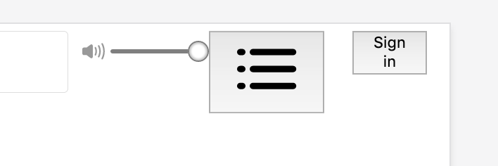

```css
.c-playback__toggle {
    appearance: none;
    border: 0;
    background: transparent;

    svg {
        width: 24px;
        height: 18px;
        fill: #c4c4c6;
    }
}
```

但是三个部分垂直排列并不是很统一垂直居中，所以作为Flex的父元素```.c-playback__user```需要添加```align-items: center```属性：

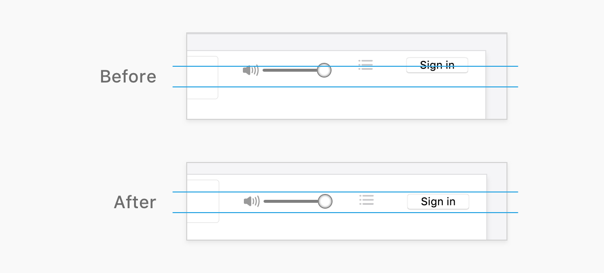

接下来就是各个组件的细节调整：

```css
.c-playback__toggle {
    appearance: none;
    border: 0;
    background: transparent;

    svg {
        width: 24px;
        height: 18px;
        fill: #c4c4c6;
    }
}

.c-button {
    appearance: none;
    border: 0;
    border-radius: 6px;
    color: #fff;
    font-size: 13px;
    background-color: #0076ff;
    padding: 6px 12px;

    svg {
        fill: #fff;
        width: 10px;
        height: 11px;
        margin-right: 4px;
    }
}
```

#### 有意思的发现

我喜欢把音量键作居中处理，再Flexbox中，auto margins很容易做到这一点，即便其他同一行的元素挨着它：

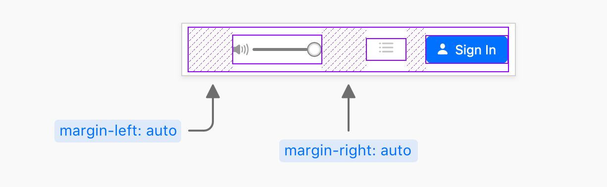

下面是代码实现：

```html
<div class="c-playback__user">
    <div class="c-playback__user__vol">
        <div class="c-input-slider">
                <svg>..</svg>
            <input type="range" name="" id="" value="100">
        </div>
    </div>
    <div class="c-playback__user__toggle">
        <button class="c-playback__toggle">
                <svg>..</svg>
        </button>
    </div>
    <div class="c-playback__user__signin">
        <button class="c-button">
            <svg>..</svg>
            Sign In
        </button>
    </div>
</div>
```

```css
.c-playback__user {
    display: flex;
    justify-content: flex-end;
    align-items: center;
}

.c-playback__user__vol {
    margin-left: auto;
    margin-right: auto;
}
```

还不错。

### 整体结果


首先左边的播放部分整体并不是垂直居中，因此：

```css
.c-playback {
    /* other styles */
    align-items: center;
}
```

居中的苹果图标也并不是绝对居中：

```css
.c-playback__lcd svg {
    position: relative;
    top: -1px;
}
```

### 响应式布局

这里需要考虑到小屏或者手机的使用。

这里需要舍去一定的组件宽度，也就是两头：

```css
.c-playback {
    display: grid;
    grid-template-columns: 0.7fr 1.1fr 1fr;
    grid-gap: 6px;
}

@media (min-width: 1135px) {
    .c-playback {
        grid-gap: 16px;
        grid-template-columns: 1fr 1.5fr 1fr;
    }
}

@media (max-width: 970px) {
    position: relative;
    display: block;

    .c-playback__controls,
    .c-playback__toggle,
    .c-input-slider {
        display: none;
    }

    .c-playback__user__signin {
        position: absolute;
        right: 24px;
        top: 12px;
    }
}
```

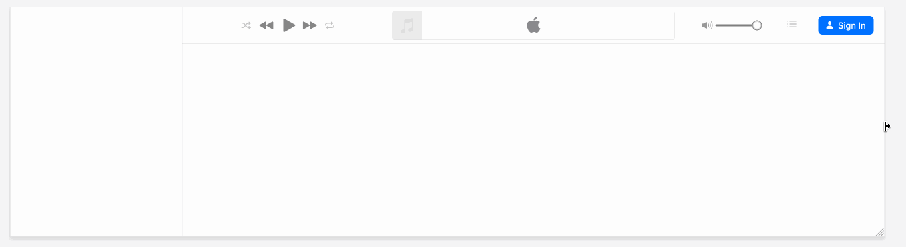

### 最后

感谢你的阅读。