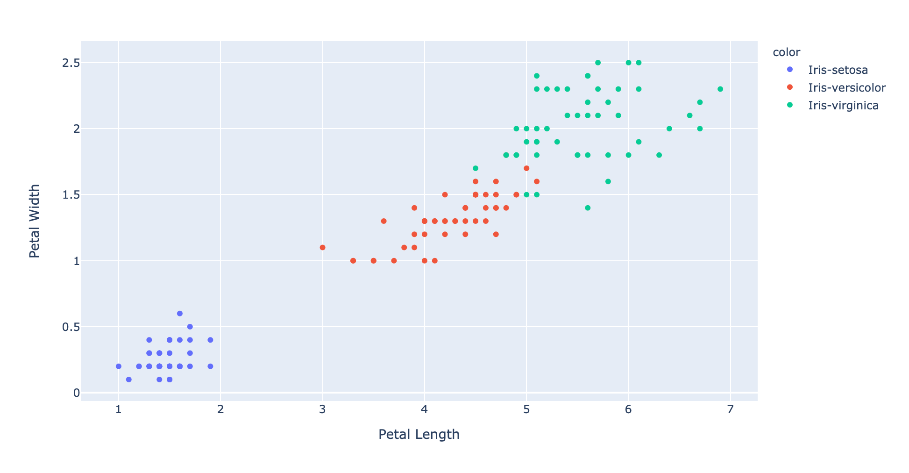
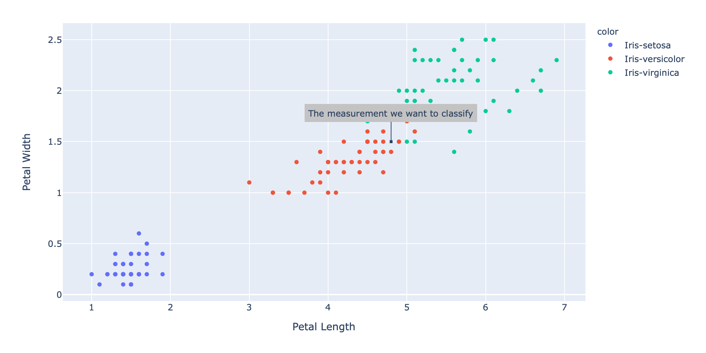

首先我们假设拿100个铲屎官和他们的猫咪做统计学实验，这里有个要求是100只猫咪里面有大概每1只猫咪和其它3只猫咪不是同一品种的，我们要把这些奇怪的猫咪拧出来。在这里我们对主子们简单列出了需要统计的指标：身高（厘米）、体重（千克）以及警惕性（区间[0,1]，0代表没有警惕性，1代表警惕）。

<!--more-->

这里做一个标准化处理，比如说sigmoid函数处理，从而使得三项指标的结果均在[0,1]的区间内，因此我们得到了一个有关判断猫咪品种的三维函数：

$$
\begin{pmatrix} 
0.5\\0.8\\0.1 
\end{pmatrix} = Persian
$$

为了更好在图表中展示，对于不同品种的猫咪我们给这些猫咪标记不同的颜色，颜色相同的猫咪表示同一种类的猫咪，比如波斯猫我们可以标记成蓝色，蓝色的点代表的是波斯猫。

因此将所有100只的猫咪样本放在坐标轴上面，问题就变成了，这100个点该标记什么样的颜色。

### K最近邻(*k-NN*，k-Nearest Neighbor)

这里涉及两个基本函数 ```Distance Function```和```Voting Function```。

#### Distance Function

这里我们需要计算“有待分类的样本”和其他已分好类的样本之间的距离，顾名思义，也就是要找到K最近邻，即最短距离。这里我们用欧几里得距离（Euclidean distance）来简单计算这个值。

$$
d(x,y)=d(y,x)= \sqrt{\sum_{r=1}^i(x_i^2-y_i^2)^2}
$$

假设我们有两个矢量a和b，因此他们之间的距离如下所示：

$$
\vec a = \begin{pmatrix}
1\\2\\3\\4
\end{pmatrix}

\vec b = \begin{pmatrix}
5\\6\\7\\8
\end{pmatrix}
$$

$$
d(a,b)=
d(b,a)= \\
\sqrt {(1-5)^2 + (2-6)^2 + (3-7)^2 +(4-8)^2} = 8
$$

python脚本就是下面这样：

```python
def distance(x: List[float], y: List[float]) -> float:
    assert len(x) == len(y)
    interim_res: float = 0
    for i, _ in enumerate(x):
        interim_res += (x[i] - y[i]) ** 2  
    return sqrt(interim_res)

assert distance([1, 2, 3, 4], [5, 6, 7, 8]) == 8
```

#### Voting Function

接下来我们需要做的事情就是当我们输入数据之后得到一组组内各个元素分类的标签，我们需要找到组内得票数最多的标签作为该组的最终分类标签，但是问题在于有一种极端情况是出现得票数并列第一的平局场面：

```python
# Do we return `a` or `b`?
labels: List[str] = ['a', 'a', 'b', 'b', 'c']
```

对于刚刚通过计算出的K最近邻，Voting Function的处理很容易，因为每一个标签都有对应的数值距离，List内部的元素按照距离进行排序，只需要按远及近的方式移除标签就可以了：

```python
# Do we return `a` or `b`?
labels: List[str] = ['a', 'a', 'b', 'b', 'c']
# Remove one entry. We're still unsure if we should return `a` or `b` labels:
List[str] = ['a', 'a', 'b', 'b']
# Remove another entry. Now it's clear that `a` is the "winner"
labels: List[str] = ['a', 'a', 'b']
```

```python
def majority_vote(labels: List[str]) -> str:
    counted: Counter = Counter(labels)
    winner: List[str] = []
    max_num: int = 0
    most_common: List[Tuple[str, int]]
    for most_common in counted.most_common():
        label: str = most_common[0]
        num: int = most_common[1]
        if num < max_num:  
            break
        max_num = num
        winner.append(label)
        if len(winner) > 1:
            return majority_vote(labels[:-1])
        return winner[0]

    assert majority_vote(['a', 'b', 'b', 'c']) == 'b'
    assert majority_vote(['a', 'b', 'b', 'a']) == 'b'
    assert majority_vote(['a', 'a', 'b', 'b', 'c']) == 'a'
```

#### K-NN

K-NN中的K表示的是就一组（List）或者单独的样本而言，我们需要考虑的其最邻近的邻居数（neighbors）：

```python
def knn(labeled_data: List[LabeledData], new_measurement, k: int = 5) -> Prediction:
    class Distance(NamedTuple):
        label: str
        distance: float
    distances: List[Distance] = [Distance(data.label, distance(new_measurement, data.measurements))  for data in labeled_data]
    distances = sorted(distances, key=attrgetter('distance'))
    labels = [distance.label for distance in distances][:k]
    label: str = majority_vote(labels)
    return Prediction(label, new_measurement)
```


### 实例：鸢尾花的分类

数据集来源于wiki页面的[鸢尾花百科](https://en.m.wikipedia.org/wiki/Iris_flower_data_set)，50个样本中包含三个不同种的鸢尾花：Iris Setosa，Iris Virginica以及Iris Versicolor。

对于每一个样本，我们只需要考虑四个参数：花萼的长度和宽度， 以及花瓣的长度和宽度。一个样本示例如下：

```python
6.9,3.1,5.1,2.3,Iris-virginica
```

四维数据的坐标是不是很难画？这里我们只考虑两个参数，比如花瓣的长宽：

```R
fig = px.scatter(x=xs, y=ys, color=text, hover_name=text, labels={'x': 'Petal Length', 'y': 'Petal Width'})
fig.show()
```



现在假设我们有一个新样本：

```python
new_measurement: List[float] = [7, 3, 4.8, 1.5]
```

然后把这个样本标在图上：

```R
fig = px.scatter(x=xs, y=ys, color=text, hover_name=text, labels={'x': 'Petal Length', 'y': 'Petal Width'})
fig.add_annotation(
    go.layout.Annotation(
            x=new_measurement[petal_length_idx],
            y=new_measurement[petal_width_idx],
            text="The measurement we want to classify")
)
fig.update_annotations(dict(
            xref="x",
            yref="y",
            showarrow=True,
            arrowhead=7,
            ax=0,
            ay=-40,
            borderwidth=2,
            borderpad=4,
            bgcolor="#c3c3c3"
))
fig.show()
```



似乎光是看图就很直观地知道分类了，还是用KNN函数验证下。

```python
knn(labeled_data, new_measurement, 5)
```

```bash
Prediction(label='Iris-versicolor', measurements=[7, 3, 4.8, 1.5])
```