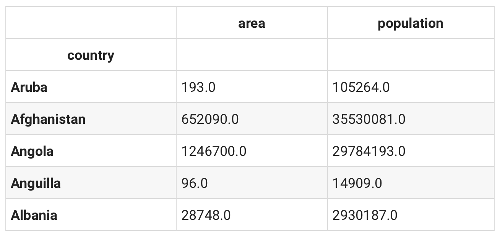
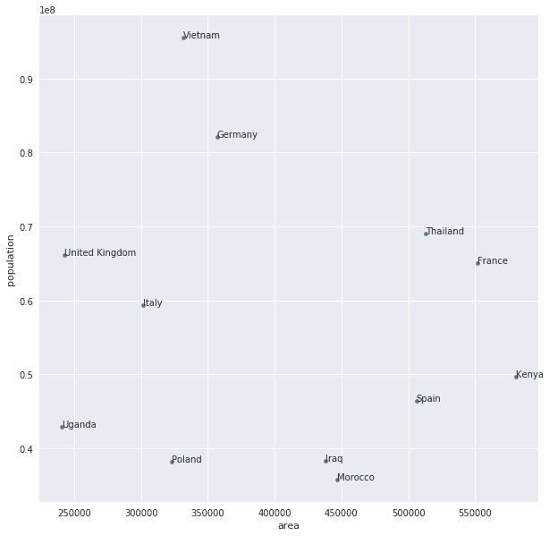
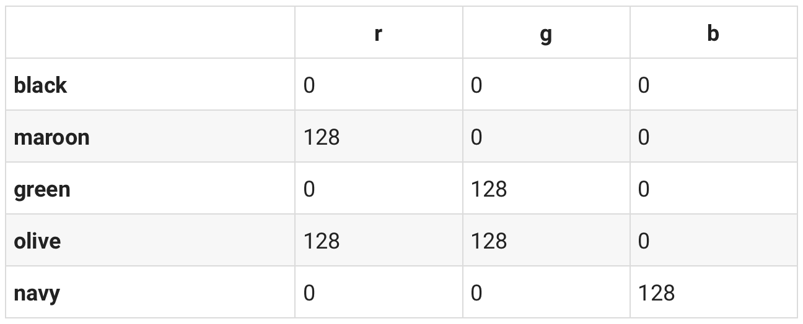
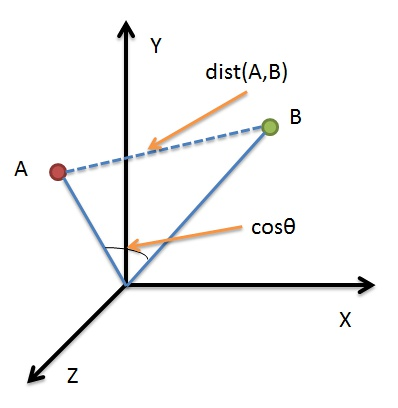
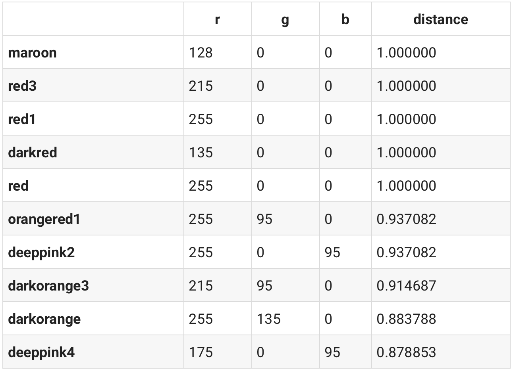
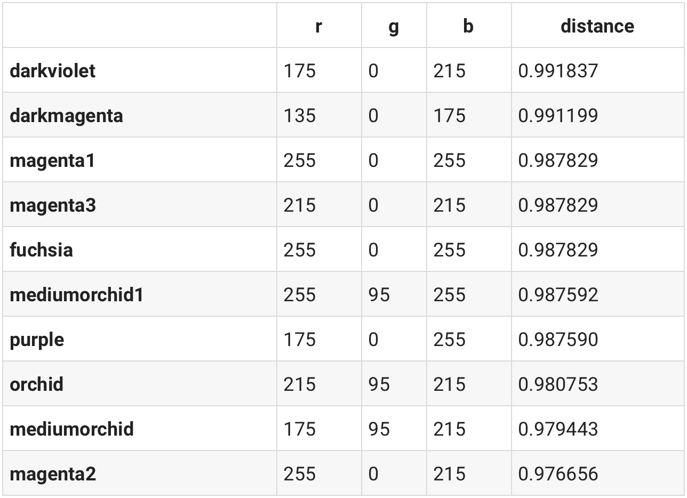
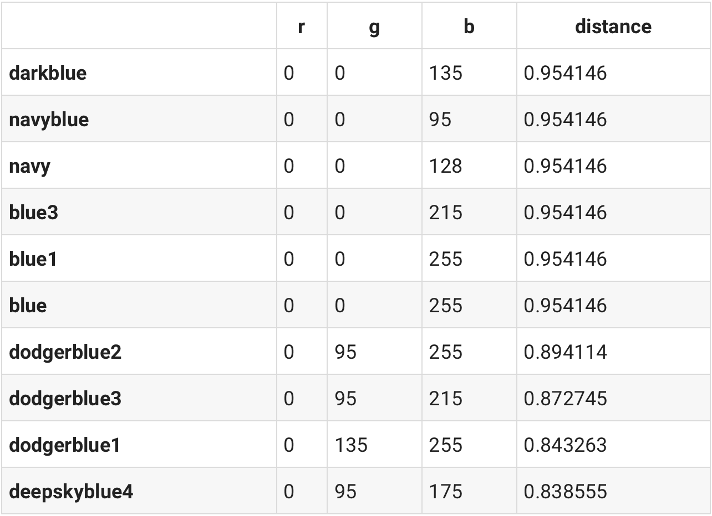

⾃然语⾔是⼀套⽤来表达含义的复杂系统。在这套系统中，词是表义的基本单元。顾名思义，词向量是⽤来表⽰词的向量，也可被认为是词的特征向量或表征。把词映射为实数域向量的技术也叫词嵌⼊（word embedding）。近年来，词嵌⼊已逐渐成为⾃然语⾔处理的基础知识。

不啰嗦，直接开始。

<!--more-->

### 安装

这里我们选择python的视觉画图工具[Seaborn](https://seaborn.pydata.org/)，这里和 [Matplotlib](https://matplotlib.org/)搭配着一起食用。

```python
!pip install seaborn
```

导入模块：

```python
import json
from pathlib import Path

import pandas as pd
import seaborn as sns
import numpy as np
from IPython.display import HTML, display

# prettier Matplotlib plots
import matplotlib.pyplot as plt
import matplotlib.style as style
style.use('seaborn')
```

我们有不同的数据源，所以需要定义数据源导出路径：

```python
!mkdir -p data
data_dir = Path('data')
```

### 数据：国家之间的对比

这里的示例是基于国土面积和人口进行国家之间的比较，我们想通过这两个方面来简单分析两个国家之间的相似度。这部分数据源来源于 [@samayo](https://github.com/samayo)的 [`country-json` 工程](https://github.com/samayo/country-json)，你可以通过[不同的JSON文件](https://github.com/samayo/country-json/tree/master/src)来了解数据源各个字段的含义。当然这里我们不可能全部下完samayo的文件，这里以 [`country-by-surface-area.json`](https://github.com/samayo/country-json/blob/master/src/country-by-surface-area.json) 和 [`country-by-population.json`](https://github.com/samayo/country-json/blob/master/src/country-by-population.json)为例。

首先定义数据源变量：

```python
SURFACE_AREA_FILE_NAME = 'country-by-surface-area.json'
POPULATION_FILE_NAME = 'country-by-population.json'
```

```python
!wget -nc https://raw.githubusercontent.com/samayo/country-json/master/src/country-by-surface-area.json -O data/country-by-surface-area.json
!wget -nc https://raw.githubusercontent.com/samayo/country-json/master/src/country-by-population.json -O data/country-by-population.json
```

```python
surface_area_file_path = str(data_dir / SURFACE_AREA_FILE_NAME)
population_file_path = str(data_dir / POPULATION_FILE_NAME)
```

数据分析工具我们使用经典的 [Pandas](https://pandas.pydata.org/)工具包，具体就是运用Pandas的[`read_json`](https://pandas.pydata.org/pandas-docs/stable/reference/api/pandas.read_json.html)函数来加载数据，并用 [`dropna`](https://pandas.pydata.org/pandas-docs/stable/reference/api/pandas.DataFrame.dropna.html)来剔除原数据中多余的部分：

```python
df_surface_area = pd.read_json(surface_area_file_path)
df_population = pd.read_json(population_file_path)

df_population.dropna(inplace=True)
df_surface_area.dropna(inplace=True)
```

国土面积和人口是两个文件，我们需要把这两个维度合并到一个文件中，因为我们是国家之间的对比，所以合并文件之后索引就是不同的国家。

```python
df = pd.merge(df_surface_area, df_population, on='country')
df.set_index('country', inplace=True)
df.head()
```



```python
len(df)
# 227
```

整个数据总共有227个国家，数据有点太多了，这里稍微限定个范围来筛选出我们想要的国家：

```python
df = df[
    (df['area'] > 100000) & (df['area'] < 600000) &
    (df['population'] > 35000000) & (df['population'] < 100000000)
]
len(df)

# 12
```

好了，现在只有12个国家，差不多了。就以这12个国家为例子，我们以国土面积为横坐标，人口为纵坐标画个图。

```python
fig, ax = plt.subplots()
df.plot(x='area', y='population', figsize=(10, 10), kind='scatter', ax=ax)

for k, v in df.iterrows():
    ax.annotate(k, v)

fig.canvas.draw()
```



写到这里似乎我以前有讲过[这个东西](https://tinniccii.netlify.com/knn%E7%AE%97%E6%B3%95%E5%86%8D%E7%AE%80%E5%8D%95%E4%B8%8D%E8%BF%87%E7%9A%84%E7%90%86%E8%A7%A3)：要比较样本群体之间的差异，也就是计算样本群体距离，方法其实有很多，不过[欧几里得公式](https://en.wikipedia.org/wiki/Euclidean_distance)来处理这个其实很简单：

```python
def euclidean_distance(x, y):
    x1, x2 = x
    y1, y2 = y
    result = np.sqrt((x1 - x2) ** 2 + (y1 - y2) ** 2)
    # we'll cast the result into an int which makes it easier to compare
    return int(round(result, 0))
```

从图上来看，泰国和乌干达的距离挺远的，来代进公式验证下：

```python
# Uganda <--> Thailand
uganda = df.loc['Uganda']
thailand = df.loc['Thailand']

x = (uganda['area'], thailand['area'])
y = (uganda['population'], thailand['population'])

euclidean_distance(x, y)

# 26175969
```

来算算摩洛哥和伊拉克之间的距离，要稍微近一点：

```python
# Iraq <--> Morocco
iraq = df.loc['Iraq']
morocco = df.loc['Morocco']

x = (iraq['area'], morocco['area'])
y = (iraq['population'], morocco['population'])

euclidean_distance(x, y)

# 2535051
```

问题来了，讲上面这东西有个毛用？

### 色彩与数学

接下来开始进入正题，我们知道颜色可以以RGB（Red红、Green绿、Blue蓝）的方式来表示，如果你是前端工程师或者视觉工程师，肯定很熟悉这个，比如RGB(0,0,0)就是代表黑色。

这里我们下载[@jonasjacek](https://github.com/jonasjacek)的[256 Colors](https://jonasjacek.github.io/colors/)作为我们的数据源，直接上了：

```python
COLORS_256_FILE_NAME = 'colors-256.json'
```

```python
!wget -nc https://jonasjacek.github.io/colors/data.json -O data/colors-256.json
```

```python
colors_256_file_path = str(data_dir / COLORS_256_FILE_NAME)
```

加载json数据，我们这里取前五项：

```python
color_data = json.loads(open(colors_256_file_path, 'r').read())
color_data[:5]

#### result：#####
[{'colorId': 0,
  'hexString': '#000000',
  'rgb': {'r': 0, 'g': 0, 'b': 0},
  'hsl': {'h': 0, 's': 0, 'l': 0},
  'name': 'Black'},
 {'colorId': 1,
  'hexString': '#800000',
  'rgb': {'r': 128, 'g': 0, 'b': 0},
  'hsl': {'h': 0, 's': 100, 'l': 25},
  'name': 'Maroon'},
 {'colorId': 2,
  'hexString': '#008000',
  'rgb': {'r': 0, 'g': 128, 'b': 0},
  'hsl': {'h': 120, 's': 100, 'l': 25},
  'name': 'Green'},
 {'colorId': 3,
  'hexString': '#808000',
  'rgb': {'r': 128, 'g': 128, 'b': 0},
  'hsl': {'h': 60, 's': 100, 'l': 25},
  'name': 'Olive'},
 {'colorId': 4,
  'hexString': '#000080',
  'rgb': {'r': 0, 'g': 0, 'b': 128},
  'hsl': {'h': 240, 's': 100, 'l': 25},
  'name': 'Navy'}]
```

hexString，rgb以及hsl三种表示颜色的不同方法，这里我们对数据进行处理建立一个以颜色名字为索引，rgb数据以元组的形式来表示的字典数据：

```python
colors = dict()

for color in color_data:
    name = color['name'].lower()
    r = color['rgb']['r']
    g = color['rgb']['g']
    b = color['rgb']['b']
    rgb = tuple([r, g, b])
    colors[name] = rgb
```

```python
print('Black: %s' % (colors['black'],))
print('White: %s' % (colors['white'],))

print()

print('Red: %s' % (colors['red'],))
print('Lime: %s' % (colors['lime'],))
print('Blue: %s' % (colors['blue'],))

### results：###
Black: (0, 0, 0)
White: (255, 255, 255)

Red: (255, 0, 0)
Lime: (0, 255, 0)
Blue: (0, 0, 255)
```

当然这里运用Pandas的[`from_dict`](https://pandas.pydata.org/pandas-docs/stable/reference/api/pandas.DataFrame.from_dict.html)函数处理也不错：

```python
df = pd.DataFrame.from_dict(colors, orient='index', columns=['r', 'g', 'b'])
df.head()
```



做到这里想到什么没有，画一个XYZ三维坐标系，然后计算样本距离。欧几里得公式当然可行，这里要介绍另外一种函数[余弦相似度：Cosine similarity](https://en.wikipedia.org/wiki/Cosine_similarity)，与欧几里德距离类似，基于余弦相似度的计算方法也是把样本作为n-维坐标系中的一个点，通过连接这个点与坐标系的原点构成一条直线（向量），两个用户之间的相似度值就是两条直线（向量）间夹角的余弦值。因为连接代表样本的点与原点的直线都会相交于原点，夹角越小代表两个用户越相似，夹角越大代表两个用户的相似度越小。同时在三角系数中，角的余弦值是在[-1, 1]之间的，0度角的余弦值是1，180角的余弦值是-1。



公式如下所示：

$$
similarity = cos(θ) =\frac {A·B}{\begin{Vmatrix}A\end{Vmatrix}\begin{Vmatrix}B\end{Vmatrix}}
$$

直接上代码，这里我们计算各个颜色距离目标样本颜色的远近，按照距离值的大小降序排列：

```python
def similar(df, coord, n=10):
    # turning our RGB values (3D coordinates) into a numpy array
    v1 = np.array(coord, dtype=np.float64)

    df_copy = df.copy()

    # looping through our DataFrame to calculate the distance for every color
    for i in df_copy.index:
        item = df_copy.loc[i]
        v2 = np.array([item.r, item.g, item.b], dtype=np.float64)
        # cosine similarty calculation starts here
        theta_sum = np.dot(v1, v2)
        theta_den = np.linalg.norm(v1) * np.linalg.norm(v2)
        # check if we're trying to divide by 0
        if theta_den == 0:
            theta = None
        else:
            theta = theta_sum / theta_den
        # adding the `distance` column with the result of our computation
        df_copy.at[i, 'distance'] = theta
    # sorting the resulting DataFrame by distance
    df_copy.sort_values(by='distance', axis=0, ascending=False, inplace=True)
    return df_copy.head(n)
```

以红色为例：

```python
similar(df, colors['red'])
```



当然也可以代入RGB数值，这颜色看上去是紫色：

```python
similar(df, [100, 20, 120])
```



前几名真的挺紫色的。

这里面有个问题，色彩直接是可以加减的，这里以红色和紫色为例：

```python
blueish = df.loc['purple'] - df.loc['red']

similar(df, blueish)
```



nice work！所以我们在此之上还可以做各种各样的色彩加减。

### Word2Vec

色彩和文字异曲同工，色彩有类似RGB的表达，文字中的每个词也可以表⽰成⼀个定⻓的向量放在多维空间里面。正如色彩之间的加减一样，文字也可以有以下类似的加减：
$$
King - man + woman = queen
$$

接下来你可以取拜读大牛Jay Alammar的[这篇文章](https://jalammar.github.io/illustrated-word2vec/)了，原文是有[中文译文链接](https://mp.weixin.qq.com/s?__biz=MjM5MTQzNzU2NA==&mid=2651669277&idx=2&sn=bc8f0590f9e340c1f1359982726c5a30&chksm=bd4c648e8a3bed9817f30c5a512e79fe0cc6fbc58544f97c857c30b120e76508fef37cae49bc&scene=0&xtrack=1#rd)的。