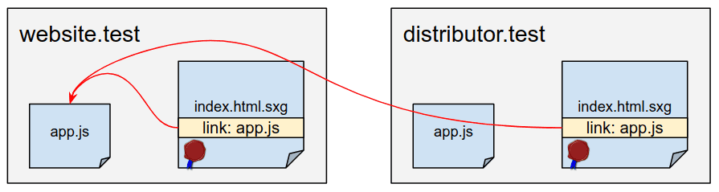
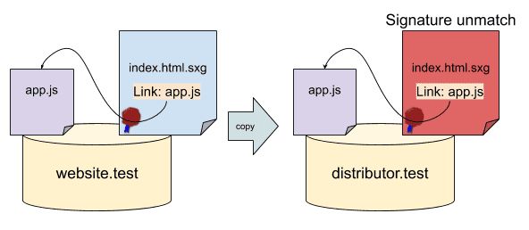
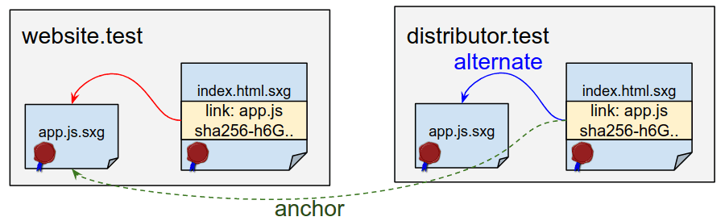

记录Signed HTTP Exchanges (SXG)的分发步骤：

接着这个[文章](https://tinniccii.netlify.app/signed-http-exchanges-(sxg)%E7%9A%84%E5%AE%89%E8%A3%85%E6%AD%A5%E9%AA%A4)写。

作为Signed HTTP Exchanges (SXG)的分发者，你代表原始应用的所有者（大概率也是你自己）分发SXG文件，这么做可以保证合法的跨站预加载。

<!--more-->

### SXG文件

在你的请求头（request header）的```Accept```属性中指定服务器是以SXG文件的形式。

```bash
Accept: application/signed-exchange;v=b3,*/*;q=0.8
```

假设文件存放路径是```/var/www/sxg```。

### 简单部署一个SXG文件

请求头接下来是：

```text
Content-Type: application/signed-exchange;v=v3
X-Content-Type-Options: nosniff
```

具体来说配置```nginx```就是下面这样：

```nginx
http {
    ...
    types {
        application/signed-exchange;v=b3  sxg;
    }
    add_header X-Content-Type-Options nosniff;

    location / {
        more_set_headers "Content-Type: application/signed-exchange;v=b3";
        alias /var/www/sxg/;
        try_files $uri.sxg $uri =404;
        autoindex off;
    }
    ...
```

配置生效：

```bash
sudo systemctl restart nginx.service
```

此时```nginx```将会部署SXG文件。当前端浏览器，比如Chrome这种访问你的服务器的时候，原内容的生产者地址将会出现在你的地址栏。

### Prefetch subresources

基本上网页应用是由CSS、Javascript、字体（fonts）以及图片（images）等这些subresources构成。如果没有这些subresources原作者的私钥（private key），SXG内容是无法被外人更改的。因此这里就要解决这个共享权限的问题。

比如说```https://website.test/index.html```地址中有一个```index.html.sxg```指向```https://website.test/app.js```。现在用户从```https://distributor.test/example.com/index.html.sxg```试图获取到相应的SXG文件，因此这个路径会指向```https://website.test/app.js```。当然，浏览器是可以直接访问```https://website.test/app.js```，但是因为安全性问题，这一过程是不会在预加载期（preload phase）完成的。假如预加载期这么干了的话，源文件（```website.test```）的主人可以检测分发者（```distributor.test```）在请求相应的内容。



假如用户想在自己的服务中部署```app.js.sxg```并且试图对```https://website.test/app.js```源代码做出更改，然后做一个自己的版本类似```https://distributor.test/website.test/app.js.sxg```，这样会产生签名不匹配的错误从而SXG失效。



要解决这个问题，Chrome浏览器的实验室模式中有个SXG预加载功能（SXG subresource prefetching），这里启动```chrome://flags/#enable-sxg-subresource-prefetching```服务，接下来：

- 生产者在响应头指明SXG文件，比如：

  ```link: <https://website.test/app.js>;rel="preload";as="script",<https://website.test/app.js>;rel="allowed-alt-sxg";header-integrity="sha256-h6GuCtTXe2nITIHHpJM+xCxcKrYDpOFcIXjihE4asxk="```

  这样告诉分发者该subresource是可以通过SXG指定的hash去编辑/替换。

- 分发者在部署SXG文件的时候同样需要相应的响应头，比如：

  ```link: <https://distributor.test/website.test/app.js.sxg>;rel="alternate";type="application/signed-exchange;v=b3";anchor="https://website.test/app.js"```

  指定```app.js```原路径。



第一步要涉及计算整数hash很好办，有[`nginx-sxg-module`](https://github.com/google/nginx-sxg-module)这个框架帮助我们从上游响应中把hash嵌入响应头里面，第二个稍微难一点，因为要清楚SXG中相应的subresources文件：

如果比如说就只有```https://website.test/app.js```这么一个需要SXG处理的文件，那么在```nginx```的配置中：

```
add_header link <https://distributor.test/website.test/app.js.sxg>;rel="alter...
```

实际生产中不可能这么简单，因为会有很多subresources文件，也就是说你要在相应所需要的文件中都得加上对应的响应头去指向源相应的文件。

现在好像也没什么简单的方法，等Google的大神更新了。

