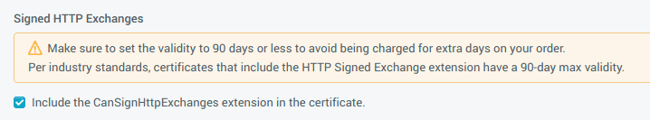

记录Signed HTTP Exchanges (SXG)的安装步骤：

<!--more-->

### 前提

- 你有可用的域名权限，包括有可用的DNS条目。
- 有可用的证书：不要重复使用TLS密钥和证书。
- 有可用的HTTP服务器用于在HTTPS基础上生成SXG。

### 技能要求

- OpenSSL 1.1.1：系统是Ubuntu 18.04 LTS和amd64 ISA。
- ```sudo```安装命令：（记不住就李彦宏，我也记不住几条linux命令，你要搞运维还是老老实实多背几条）
- ```nginx```作为HTTP服务器。
- 证书生产工具用的是```DigiCert```：好些目前SXG的相关扩展插件也只能用这个玩意儿。

假设有个现成的域名是```tincochan.com```。

### 1.证书

这里用```CanSignHttpExchanges```扩展插件生成证书，当然包括证书私钥和证书请求文件CSR，这里假设证书文件名是```mySxg.pem```：

```bash
openssl ecparam -genkey -name prime256v1 -out mySxg.key
openssl req -new -key mySxg.key -nodes -out mySxg.csr -subj "/O=Test/C=US/CN=tincochan.com"
```

大概CSR文件长这样：

```bash
-----BEGIN CERTIFICATE REQUEST-----
MIHuMIGVAgEAMDMxDTALBgNVBAoMBFRlc3QxCzAJBgNVBAYTAlVTMRUwEwYDVQQD
DAx3ZWJzaXRlLnRlc3QwWTATBgcqhkjOPQIBBggqhkjOPQMBBwNCAAS7IVaeMvid
S5UO7BspzSe5eqT5Qk6X6dCggUiV/vyqQaFDjA/ALyTofgXpbCaksorPaDhdA+f9
APdHWkTbbdv1oAAwCgYIKoZIzj0EAwIDSAAwRQIhAIb7n7Kcc6Y6pU3vFr8SDNkB
kEadlVKNA24SVZ/hn3fjAiAS2tWXhYdJX6xjf2+DL/smB36MKbXg7VWy0K1tWmFi
Sg==
-----END CERTIFICATE REQUEST-----
```

这里要注意如下图勾选且满足90天内的有效期设置，否则因为安全性问题是无法通过的：



### 2. libsxg

SXG格式很难搞，这里可以用现成的框架生成SXG：

- Go语言写的[gen-signedexchange](https://github.com/WICG/webpackage/tree/master/go/signedexchange)
- C语言写的[`libsxg` library](https://github.com/google/libsxg)

这里用第二个框架，这里又有两种方法。

#### 2.1 Debian包安装

Debian已经具备了相对一站式全家桶：

```bash
sudo apt install -y libssl-dev
wget https://github.com/google/libsxg/releases/download/v0.2/libsxg0_0.2-1_amd64.deb
wget https://github.com/google/libsxg/releases/download/v0.2/libsxg-dev_0.2-1_amd64.deb
sudo dpkg -i libsxg0_0.2-1_amd64.deb
sudo dpkg -i libsxg-dev_0.2-1_amd64.deb
```

#### 2.2 从头安装

前提是你的自定义linux系统已经安装了```git```，```cmake```，```openssl```，```gcc```。

```bash
git clone https://github.com/google/libsxg
mkdir libsxg/build
cd libsxg/build
cmake .. -DRUN_TEST=false -DCMAKE_BUILD_TYPE=Release
make
sudo make install
```

### 3.nginx插件

这里是动态生成SXG的步骤，方法如上同样是两种：

#### 3.1 Debian包安装

基于[SXG module for `nginx`](https://github.com/kumagi/nginx-sxg-module)：

```bash
sudo apt install -y nginx
wget https://github.com/google/nginx-sxg-module/releases/download/v0.1/libnginx-mod-http-sxg-filter_1.15.9-0ubuntu1.1_amd64.deb
sudo dpkg -i libnginx-mod-http-sxg-filter_1.15.9-0ubuntu1.1_amd64.deb
```

#### 3.2 从头安装

```bash
git clone https://github.com/google/nginx-sxg-module
wget https://nginx.org/download/nginx-1.17.5.tar.gz
tar xvf nginx-1.17.5.tar.gz
cd nginx-1.17.5
./configure --prefix=/opt/nginx --add-dynamic-module=../nginx-sxg-module --without-http_rewrite_module --with-http_ssl_module
make
sudo make install
```

假设安装路径是```/opt/nginx```。

### 4.nginx配置

针对以上两种方法这里对应两种配置：

#### 4.1 Debian式的配置

传输SXG内容需要HTTPS，SSL/TLS证书可以从DigiCert获取到，这里你已经配置好了HTTPS。这里要注意的是，你不能用SXG证书去干SSL或者用SSL证书去干SXG。因此两者各需要一个证书，也就是两个证书。相关的配置文件在```/etc/nginx/nginx.conf```里面，假设SSL密钥或者证书的安装路径是在```/path/to/ssl/```，SXG是安装在```/path/to/sxg/```：

```nginx
user www-data;
include /etc/nginx/modules-enabled/*.conf;

events {
     worker_connections 768;
}

http {
    include       mime.types;
    default_type  application/octet-stream;
    add_header  X-Content-Type-Options nosniff;

    server {
        listen 443 ssl;
        ssl_certificate     /path/to/ssl/fullchain.pem;
        ssl_certificate_key /path/to/ssl/privkey.pem;
        server_name  website.test;

        sxg on;
        sxg_certificate     /path/to/sxg/mySxg.pem;
        sxg_certificate_key /path/to/sxg/mySxg.key;
        sxg_cert_url        https://tincochan.com/certs/cert.cbor;
        sxg_validity_url    https://tincochan.com/validity/resource.msg;
        sxg_cert_path       /certs/cert.cbor;

        root /var/www/html;
    }
}
```

- sxg_cert_url：证书链（sxg_cert_url）定位路径。证书链包括了证书本身以及cbor格式的OCSP信息。
- sxg_validitiy_url：SXG签名头部相关信息（SXG-signature-header-related）

启动```nginx```享受SXG：

```bash
sudo systemctl start nginx.service
curl -H"Accept: application/signed-exchange;v=b3" https://tincochan.com/ > index.html.sxg
cat index.html.sxg
sxg1-b3...https://tincochan.com/...(omit)
```

#### 4.2 自定义式的

在```/opt/nginx```路径下配置```nginx```：

```nginx
load_module "/opt/nginx/modules/ngx_http_sxg_filter_module.so";

events {
    worker_connections 768;
}

http {
    include       mime.types;
    default_type  application/octet-stream;
    add_header X-Content-Type-Options nosniff;

    server {
        listen 443 ssl;
        ssl_certificate     /path/to/ssl/fullchain.pem;
        ssl_certificate_key /path/to/ssl/privkey.pem;
        server_name  example.com;

        sxg on;
        sxg_certificate     /path/to/sxg/mySxg.pem;
        sxg_certificate_key /path/to/sxg/mySxg.key;
        sxg_cert_url        https://tincochan.com/certs/cert.cbor;
        sxg_validity_url    https://tincochan.com/validity/resource.msg;
        sxg_cert_path       /certs/cert.cbor;

        root /opt/nginx/html;
    }
}
```

启动```nginx```享受SXG：

```bash
cd /opt/nginx/sbin
sudo ./nginx
curl -H "Accept: application/signed-exchange;v=b3" https://tincochan.com/ > index.html.sxg
less index.html.sxg
sxg1-b3...https://tincochan.com/...(omit)
```

### 5.后端启动服务

以上的配置基于nginx在系统根目录动态加载静态文件的方式来着，当然如果是后端框架加载web静态应用的话，比如Spring boot、Express或者Django这样的，这里把nginx看成单纯的前端HTTPS服务器就可以了：

```nginx
upstream app {
    server 127.0.0.1:8080;
}

server {
    location / {
        proxy_pass http://app;
    }
}
```

### 6.测试

测试工具用的是 [dump-signedexchange tool](https://github.com/WICG/webpackage/tree/master/go/signedexchange) ：

```bash
go get -u github.com/WICG/webpackage/go/signedexchange/cmd/dump-signedexchange
export PATH=$PATH:~/go/bin
dump-signedexchange -verify -uri https://tincochan.com/ | less
```