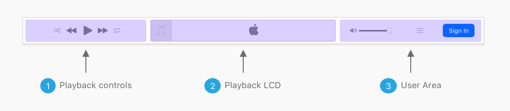

### 看起来成品似乎还不错


#### 布局



改造后的header需要考虑到以下几个因素：

1. 三个组件部分整合到一起时它们各自的宽度要足够充分；
2. 组件宽度是自适应的；
3. 每个组件需要三分之一的可利用空间宽度，当然中间的LCD部分需要比两头宽。

于是乎，先写一个基本的html：

```
<div class="c-playback">
     <div class="c-playback__controls">Playback controls</div>
     <div class="c-playback__lcd">Playback LCD</div>
     <div class="c-playback__user">User Area</div>
</div>
```


#### CSS Flexbox

```
.c-playback__controls,
.c-playback__user {
    flex-grow: 1;
}

.c-playback__lcd {
    flex-grow: 2;
}
```