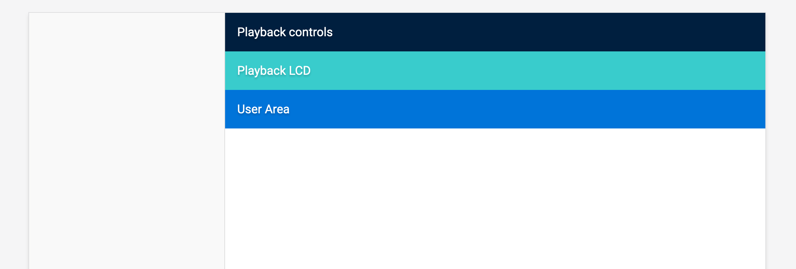
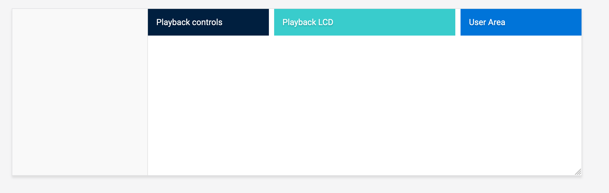

<!--more-->

### 看起来成品似乎还不错


#### 布局


改造后的header需要考虑到以下几个因素：

1. 三个组件部分整合到一起时它们各自的宽度要足够充分；
2. 组件宽度是自适应的；
3. 每个组件需要三分之一的可利用空间宽度，当然中间的LCD部分需要比两头宽。

于是乎，先写一个基本的html：

```html
<div class="c-playback">
     <div class="c-playback__controls">Playback controls</div>
     <div class="c-playback__lcd">Playback LCD</div>
     <div class="c-playback__user">User Area</div>
</div>
```



#### CSS Flexbox

```css
.c-playback__controls,
.c-playback__user {
    flex-grow: 1;
}

.c-playback__lcd {
    flex-grow: 2;
}
```

LCD组件部分的CSS是```flex-grow: 2```：


看起来似乎还不错，但这不是最好的解决方案，如果采用CSS Grid的方案我可以做得更好，因为调整每个html内部中的column以及它们之间添加间隙会轻松不少。

#### CSS Grid

首先按照比例对三个区域进行划分：

```css
.c-playback {
    display: grid;
    grid-template-columns: 30% 40% 30%;
}
```

区域之间添加```10px```间隙：

```css
.c-playback {
    display: grid;
    grid-template-columns: 30% 40% 30%;
    grid-gap: 10px;
}
```

看上去由内味儿了：


当然这里面有个疑问是使用百分比宽度会变成了这样，如果这样总宽度就会按照各个column宽度的百分比增加。也就是说```.c-playback```的宽度变成了100px + 20px，于是出现了横向的滑动条。

于是这里使用CSS函数```calc()```，很好理解，百分比宽度减去固定宽度值:

```css
.c-playback {
    display: grid;
    grid-template-columns: calc(30% - 10px) 40% calc(30% - 10px);
    grid-gap: 10px;
}
```

但是这种解决方案并不是一劳永逸的，我们尽可能地希望以百分比的方式解决问题，所以我们这里使用CSS Grid的属性```fr```来实现：

```css
.c-playback {
    display: grid;
    grid-template-columns: 1fr 1.5fr 1fr;
    grid-gap: 10px;
}
```



#### 大屏

假设我们的网站设计需要在大屏显示上展示，但是我们测试时显示器就那么大，可怎么办？简单一点，可以用```ctrl+-```来模拟网站放大后局部组件的效果。这里放大到大概2200px试试：


你是不是觉得这种方式有点low逼，那我们干脆锁定最大显示宽度好了，从而保持容器组件居中：

```css
.c-playback {
    /*Other styles*/
    max-width: 1500px;
    margin-left: auto;
    margin-right: auto;
}
```


还可以吧。