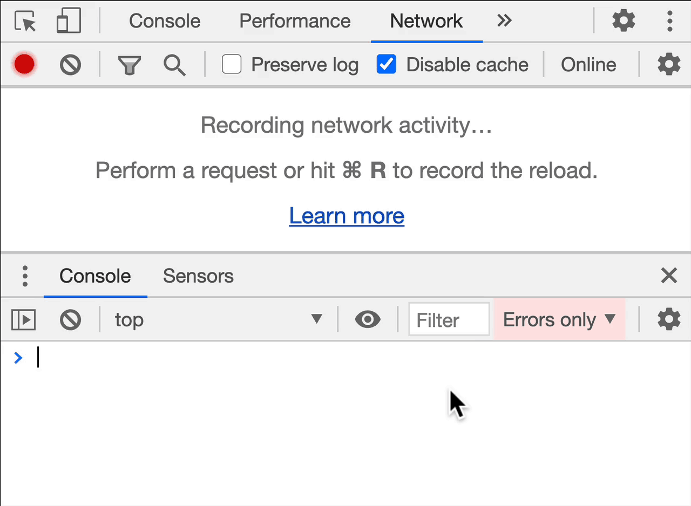
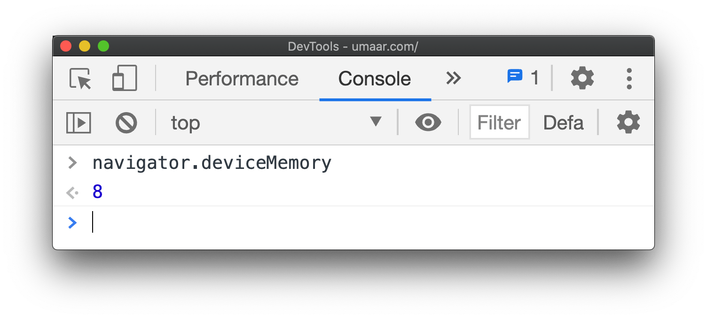
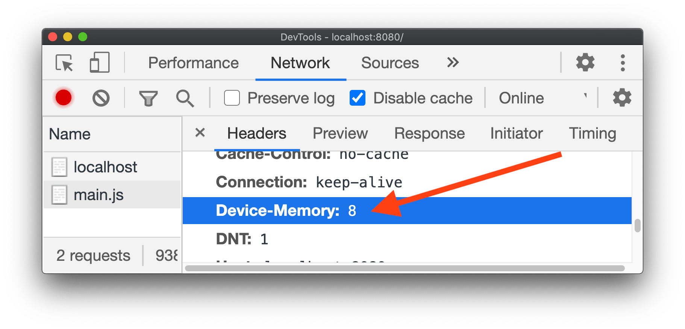
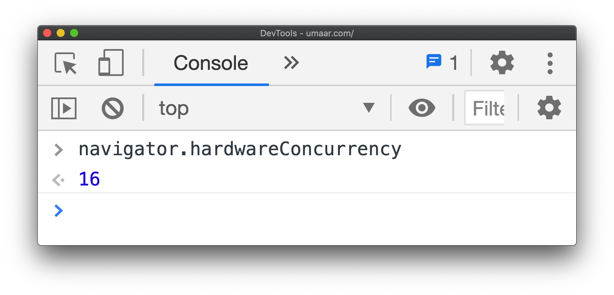
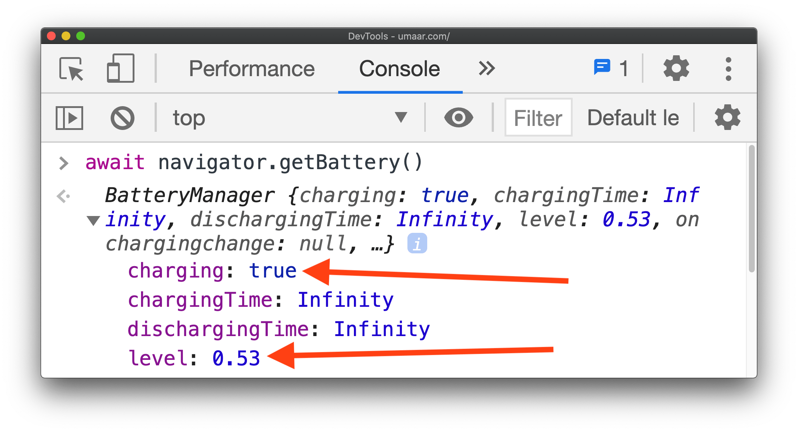
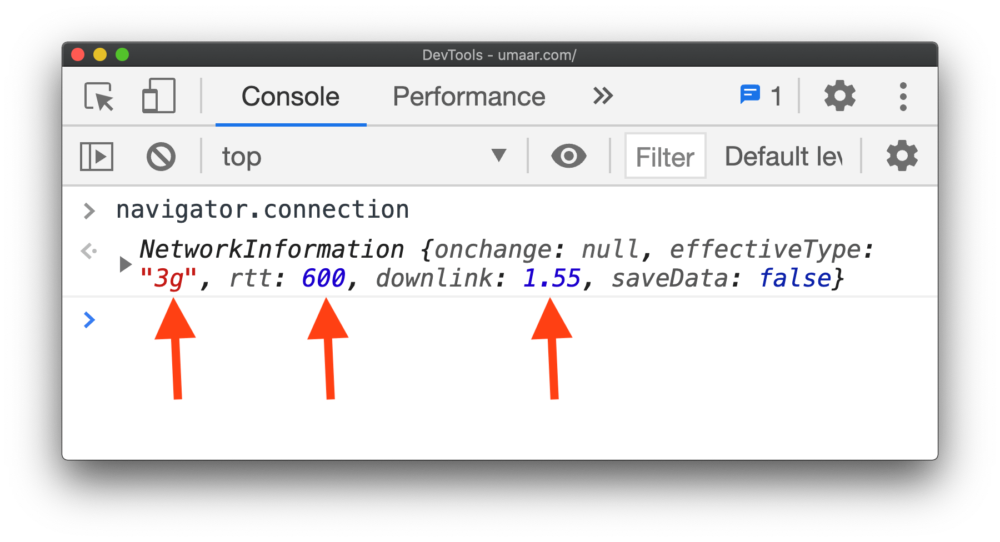
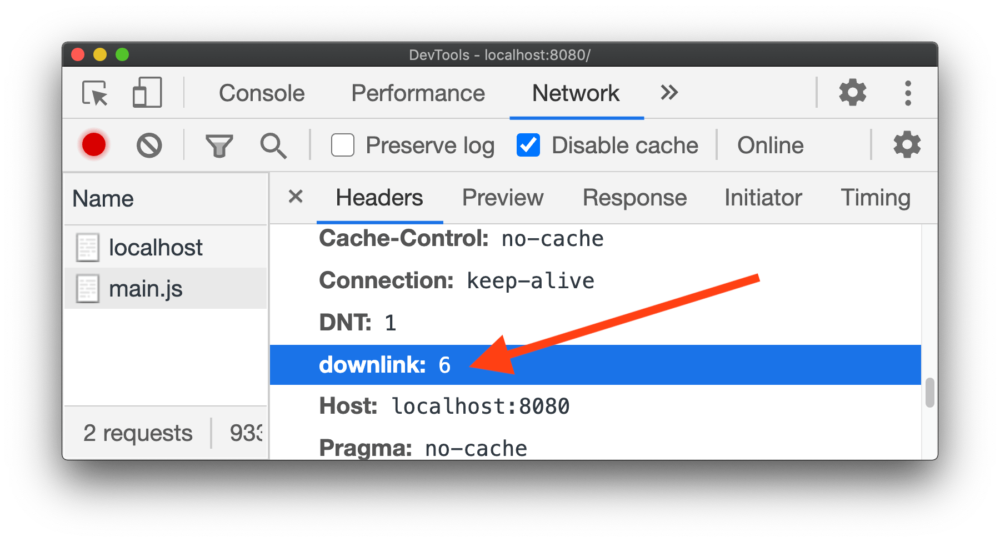

好久没有写过博客了，主要是我太懒了真的。

<!--more-->

在某些场景下，比如用户的电脑或者手机设备没有足够的内存，这个时候你作为开发者需要告诉用户忽略加载某些JS资源。比如你写了个Wiki，这个时候基于```navigator.deviceMemory```+```navigator.getBattery()```+```navigator.connection.downlink```的JS资源项就并非必需的。

不过很多时候某些JS资源是必须加载的，比如你基于WebGL开发了一款网页游戏，这个时候你不需要考虑```navigator.deviceMemory```。



### 当设备有足够的内存加载JS的时候

```javascript
if (navigator.deviceMemory > 1) {
    await import('./costly-module.js');
}
```



代码仅限于Chromium内核浏览器，当```navigator.deviceMemory```为```undefined```，可能这个时候不需要考虑是否选择性加载JS这个问题。

### 监控服务器的内存



```html
<meta http-equiv="Accept-CH" content="Device-Memory">
```

### 当设备有足够的CPU执行加载JS

```javascript
if (navigator.hardwareConcurrency > 4) {
    await import('./costly-module.js');
}
```



当创建一个新的```workers```时这个功能尤其有用。

### 当设备有足够的电量执行加载JS

加载JS、CSS或者图片视频什么的网页比不需要加载这些的网页要耗电很多。

```javascript
// { level: 0.53 (53%), charging: true...}
const {level, charging} = await navigator.getBattery();

// If the device is currently charging
// Or the battery level is more than 20%
if (charging || level > 0.2) {
        await import('./costly-module.js');
}
```



### 当设备有足够的容量大小执行加载JS

```javascript
const {quota} = await navigator.storage.estimate();
const fiftyMegabytesInBytes = 50 * 1e+6;

if (quota > fiftyMegabytesInBytes) {
    await import('./costly-module.js');
}
```


### 当设备有良好的网络执行加载JS

```javascript
// ⚠️ 4g does not mean fast!
if (navigator.connection.effectiveType === '4g') {
    await import('./costly-module.js');
}
```

这里的```downlink```属性告诉开发者当前带宽数（Mbps），设定```navigator.connection.downlink```小的时候，就加载小点的JS或者图片什么的。必须要强调的是Wifi或者4G不代表加载速度很快，3G不代表加载速度就很慢。



```html
<meta http-equiv="Accept-CH" content="Downlink">
```



当然，你也可以用```content="ECT"```获取有效的网络链接类型。

### Save-data

```javascript
if (navigator.connection.saveData === false) {
    await import('./costly-module.js');
}
```

```saveData``` 打开/请求数据保护模式