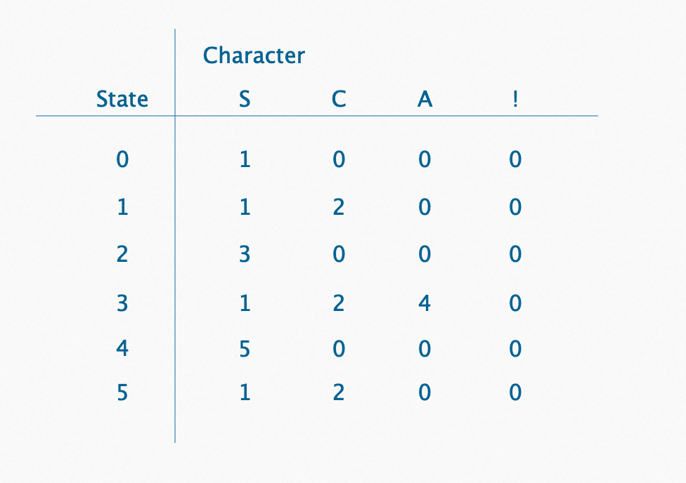

主要介绍了一些主流的解析器是怎么实现like的语法逻辑，接着分析了几种实现方式的优劣，最终采用状态机的方式，针对场景一步一步进行性能优化。

<!--more-->

最近在优化项目的like语法，那既然谈到了SQL，我们不妨来看看一些主流的解析器是怎么实现like的语法逻辑。这里需要提一下主流的两种SQL解析器，它们分别是ANTLR和Calcite。

ANTLR是一款功能强大的语法分析器生成器，可以用来读取、处理、执行和转换结构化文本或者二进制文件。在大数据的一些SQL框架里面有广泛的应用，比如Hive的词法文件是ANTLR3写的，Presto词法文件也是ANTLR4实现的。但是ANTLR并不会直接实现具体的语法，因此没办法找到实现语句。

Calcite简化了ANTLR生成代码的过程，它提供了标准的 SQL 语言、多种查询优化和连接各种数据源的能力，同时Calcite 有着良好的可插拔的架构设计，可以让用户很方便的给自己的系统套上一个SQL的外壳，并且提供足够高效的查询性能优化，因此也获得了不少开发者的青睐。这里附上找到的Calcite对于like逻辑匹配的实现。

```java
/** SQL {@code LIKE} function. */
public static boolean like(String s,String pattern){    
  final String regex = Like.sqlToRegexLike(pattern, null);    
  return Pattern.matches(regex, s)
;}
```

```java
/** Translates a SQL LIKE pattern to Java regex pattern.*/
static String sqlToRegexLike(String sqlPattern,char escapeChar) {
    int i;
    final int len = sqlPattern.length();
    final StringBuilder javaPattern = new StringBuilder(len + len);
    for (i = 0; i < len; i++) {
      char c = sqlPattern.charAt(i);
      if (JAVA_REGEX_SPECIALS.indexOf(c) >= 0) {
        javaPattern.append('\\');
      }
      if (c == escapeChar) {
        if (i == (sqlPattern.length() - 1)) {
          throw invalidEscapeSequence(sqlPattern, i);
        }
        char nextChar = sqlPattern.charAt(i + 1);
        if ((nextChar == '_')
            || (nextChar == '%')
            || (nextChar == escapeChar)) {
          javaPattern.append(nextChar);
          i++;
        } else {
          throw invalidEscapeSequence(sqlPattern, i);
        }
      } else if (c == '_') {
        javaPattern.append('.');
      } else if (c == '%') {
        javaPattern.append("(?s:.*)");
      } else {
        javaPattern.append(c);
      }
    }
    return javaPattern.toString();
}
```

还有一些别的编译器或者中间件，比如TDDL，附上我找到的实现方式，我们简单看下其实现方式，整体差不多，就是buildPattern的逻辑不太相同。

```java
...
try {
    Pattern pattern = patterns.get(buildKey(right, escTmp), new Callable<Pattern>() {
        @Override
        public Pattern call() throws Exception {
            return Pattern.compile(buildPattern(right, escTmp), Pattern.CASE_INSENSITIVE);
        }
    });
    Matcher m = pattern.matcher(left);
    return m.matches() ? 1l : 0l;
} catch (ExecutionException e) {
    throw new FunctionException(e.getCause());
}
...
```

到此，综上来看，不少项目是基于正则表达式来完成的，接下来我整理了下我最近实现的几种方式：

## 正则表达式实现

Java的正则表达式与SQL的"like"具有不同的语法。最重要的就是必须转义Java视为特殊字符的任何字符，简单处理了下regexParse函数里面就是对于特殊符号的遍历替换操作比如/([](){}.*+?$^|#\)/等。

```java
public static boolean like(final String dest, final String pattern) {
    String regex = regexParse(pattern);
    regex = regex.replace("_",".").replace("%",".*?");
    Pattern p = Pattern.compile(regex,Pattern.CASE_INSENSITIVE | Pattern.DOTALL);
    return p.matcher(dest).matches();
}
```

这种方式在代码层面简单明了，但是性能非常差，多次replace的使用就已经进行了多次遍历，这里有个可以优化的点，对于单个字符做替换可以选择用replaceChars(str, searchChar, replaceChar)这个方案。

Java 语言使用的正则表达式执行引擎是 NFA (Non-deterministic finite automaton) 非确定型有穷自动机，这种引擎的特点是：功能很强大，但存在回溯机制导致执行效率慢（回溯严重时可以导致机器 CPU 使用率 100%，直接卡死机器），正则里对于Pattern的处理相关的优化也是可以做的，将编译后的Pattern对象缓存下来，避免反复编译Pattern（对于每一个pattern-exprstr需要缓存一个Pattern），尽量选择懒惰模式和独占模式，避免使用贪婪模式（默认）。

这里说的三种模式分别是：贪婪模式、懒惰模式、独占模式

### 贪婪模式

数量表示符默认采用贪婪模式，除非另有表示。贪婪模式的表达式会一直匹配下去，直到无法匹配为止。如果发现表达式匹配的结果与预期的不符合，很有可能是因为咱们以为表达式只会匹配前面几个字符，实际确会不停匹配。

### 懒惰模式

与贪婪模式相反，懒惰模式会尽量匹配更少的内容，如上面对于百分号的处理。

### 独占模式

独占模式应该算是贪婪模式的一种变种，它同样会尽量匹配更多的内容，区别在于在匹配失败的情况下不会触发回溯机制，而是继续向后判断，所以该模式效率最佳。

## 简单算法实现

有什么比裸写一个定制版的like更好呢，简单易用，对于内存和性能几乎到了最优的地步，最复杂的情况是O(n,m))，有点类似于做一道算法题一样，纯一个match过程，不需要前置的缓存处理，下面用的双指针的方法实现，也可以考虑动态规划去做。(一部分的代码隐藏了)。

```java
public static boolean like(final String dest, final String pattern) {
    int destPointer = 0, patternPointer = 0;
    int destRecall = -1, patternRecall = -1;
    final int patternLen = pattern.length();
    final int destLen = dest.length();
    while( destPointer < destLen) {
        ......
        ......
    }
    while(patternPointer < patternLen && pattern.chatAt(patternPointer) == '%') {
        patternPointer++;
    }
    return patternPointer == patternLen;
}
```

有个场景我们不得不去考虑，那就是回溯的情况，举个例子：

对于pattern = "a%bcd" 同时匹配 abcde和 abcdbcdbcd这两种情况是无法一样的，用这种方式就需要记录回溯标记（后面我会讲一种方法不需要用到回溯）

如果说这是最省内存的方法的话，确实只用到了内部的几个变量就完成了全部的工作，硬要说缺点的话，就是可维护性太差了，逻辑处理之间藕断丝连，将来如果针对语法做一些扩展，那将会是一个比较棘手的改动。

## 有限状态机实现

状态机有 3 个组成部分：状态、事件、动作。

状态：所有可能存在的状态。包括当前状态和条件满足后要迁移的状态。

事件：也称为转移条件，当一个条件被满足，将会触发一个动作，或者执行一次状态的迁移。

动作：条件满足后执行的动作。动作执行完毕后，可以迁移到新的状态，也可以仍旧保持原状态。动作不是必需的，当条件满足后，也可以不执行任何动作，直接迁移到新状态。

一般使用涉及到穷举法、查表法、状态模式

### 穷举法

状态机最简单的实现方式，利用if-else或者switch-case，参照状态转移图，将每一种状态转移直接翻译成代码。对于简单的状态机，分支逻辑法的实现方式可以接受。对于复杂的状态机，缺点是容易漏写、错写某些状态转移。除此之外，代码中充斥着大量的if-else，可读性、可维护性都很差。

### 查表法

查表法适用于实现状态、事件类型很多、状态转移比较复杂的状态机，利用二维数组表示状态转移表，能极大的提高代码的可读性和可维护性。在二维数组的表示形式中，用数组transitionTable和actionTable分别表示状态转移和动作执行。在这两个数组中，横坐标都表示当前状态，纵坐标都表示发生的事件，值则分别表示转移后的新状态和需要执行的动作。

查表法这里引用一个入门举例：

比如有个pattern为"SCSAS"的字符串，那我们尝试梳理一下这个字符串对应的状态转移表,"!"表示与"S","C","A"无关的字符，下面为有限状态机状态转换表：



下图为pattern为 "SCSAS" 的有限状态机状态转换图：


接下来就是match的过程，拿到dest字符串，按照表中的状态数据依次匹配字符就好了，直到找到State = 5的值。

### 状态模式

状态模式通常是表达实现状态不多、状态转移简单，但是事件触发动作所包含的业务逻辑比较复杂的状态机。将不同状态下事件所触发的状态转移和动作执行，拆分到不同的状态类中，来避免分支判断逻辑。

和查表法相比，当状态模式会引入较多的状态类，对于状态比较多的推荐使用查表法；而对于状态比较少，但是动作复杂的，状态模式更加适合。

那么like的实现基于状态模式的方式会更方便。动手前我们需要做个简单的分析。假如测试的语句是 'CBEED' like '%B%E%D%'，显而易见这个结果肯定是为true的，那么我们怎么实现这么个状态机呢？

具体的拆解可以分为两个部分，状态机的构建和运行匹配。

```java
public void compile(final String pattern) {
    ...
    LikeStateMachine machine = LikeStateMachine.build(pattern);
    ...
}
```

构建的过程就是我们把pattern解析加载的过程，我采用的方式是构建链表的方式。实现就是遍历构建的过程，compile时间复杂度O(n)


那么最终的匹配结果可以是图1，也可以是图2，这取决于匹配的逻辑是倒序优先的还是正序优先的


这里的难度的在于匹配的可能性不是唯一的，同时并不是每个百分号符号对应的字符是同一个。比如下面这个case


因此我在做matcher状态设计的时候就定义了5种状态类型，最终帮助我实现了整体的逻辑。上面这种方式在实现的时候也需要考虑到回溯的情况，JUMP就是专门为回溯设计的。


因此整体下来由状态机相关的类一共需要定义5个，足以完成我们的功能以及足够的扩展性。

（LikeStateMachine）---状态机 

（LikeStateMatcher）---状态机匹配器 （LikeState）---状态机节点

（LikeStateStatus）---状态机节点状态 （LikeStateWord）---状态机匹配词 

## 回溯场景优化

我在想怎么能够优化掉这种可逆的场景，因为回溯的存在让整个逻辑变得复杂，因此我的目标就是让复杂的逻辑表达更简单一点，我尝试在编译的阶段处理更多的事情，以便于匹配的时候能获取更好的性能。相比之前的case，我对pattern数据进行了类似split的操作，将非百分号的部分用字符串的形式进行了表达，效果出乎意料的好。举个例子，'%BF%EA%D'，下面是它的优化过程。


我对几种场景进行了场景类型定义：%a = TYPE:LEFT a% = TYPE:RIGHT %a% = TYPE:SURROUND

任何带有'%'的pattern都可以被解析成这三种类型，同时我们的状态机节点个数被优化掉了不少。基于这样的实现方式后，回溯逻辑就变得不复存在了，通过当前节点和下个节点的联合校验就能识别，最终能做到O(n) ，同时对于一些场景，可以通过类型+长度判断就能识别，无需继续遍历。让我们在看下之前回溯的case，pattern = "a%bcd" 同时匹配 abcde和 abcdbcdbcd，对于这种RIGHT+LEFT的场景做下特殊处理就行。


## 常用场景优化

到目前为止那么是不是还能做进一步的优化呢？其实还可以基于常用的场景再次进一步的优化，我尝试把这些场景罗列出来，

'ab' like 'abc','ab' like 'abc%','ab' like '%abc','ab' like '%abc%'

可能超过80%的使用场景莫过于上面这些常规运用了，这个时候我想又可以在编译的时候识别到这样的场景了并且做进一步的优化了。

'ab' like 'abc' ----> equals("abc")

'ab' like 'abc%' (或者类似'abc%%','abc%%%' 以n个'%'结尾)----> startsWith("abc")

'ab' like '%abc' (或者类似'%%abc','%%%abc' 以n个'%'开始)----> endsWith("abc")

'ab' like '%abc%'(或者类似'%%abc%%', 被n个'%'围绕前后)----> contains("abc")

'ab' like '%'(或者类似'%%', n个'%')----> true

尽量使用jdk底层的能力去做这样的事，在长度检验等判断上就可能不需要再遍历了。

```java
public LikeParserResult compile(final String pattern) {
    return parseLikeExpress(pattern);
}

....
public boolean match(final String dest, LikeParserResult likeParserResult) {
    switch (likeParserResult.getMatchResult()) {
        case LikeMatchResult.TYPE.ALLMATCH:
            return true;
        case LikeMatchResult.TYPE.EQUALS:
            return doEquals(dest, likeParserResult.getFinalPattern());
        case LikeMatchResult.TYPE.STARTSWITH:
            return doStartsWith(dest, likeParserResult.getFinalPattern());
        case LikeMatchResult.TYPE.ENDSWITH:
            return doEndsWith(dest, likeParserResult.getFinalPattern());
        case LikeMatchResult.TYPE.CONTAINS:
            return doContain(dest, likeParserResult.getFinalPattern());
        default:
            //或者别的实现
            return likeParserResult.getLikeStateMachine().match(dest);
    }
}
```

上面给出的代码是为了清楚的看到里面运行，最终根据自己擅长的代码风格（函数式Function，接口等），还可以进一步优化和精简。

```java
...
public LikeParserResult compile(final String pattern) {
        return parseLikeExpress(pattern);
}


public boolean match(final String dest, LikeParserResult likeParserResult) {
        return likeParserResult.getMatcher().match(dest);
}


...

public class StartsWithMatcher implements Matcher {
    ...
    
    @Override
    public Boolean match(String dest) {
        return dest.startsWith(this.pattern);
    }
}
...
```

## 压测数据对比

| 算法/运行1亿次avgms/业务场景 | 短-精确匹配pattern = "halo",dest = "halo";                   | 短-只存在百分号pattern = "%",dest = "hello";                 | 短-右匹配pattern = "he%",dest = "hello!";                    | 短-左匹配pattern = "%go",dest ="let's go";                   | 短-双向匹配pattern = "%wo%",dest ="world";                  | 短-右左匹配pattern = "he%lo",dest ="hello";                  | 短-双左匹配pattern = "%he%lo",dest ="hello";                 |
| ---------------------------- | ------------------------------------------------------------ | ------------------------------------------------------------ | ------------------------------------------------------------ | ------------------------------------------------------------ | ----------------------------------------------------------- | ------------------------------------------------------------ | :----------------------------------------------------------- |
| 状态机(提前编译)             | 11                                                           | 7                                                            | 181                                                          | 321                                                          | 492                                                         | 1198                                                         | 1477                                                         |
| 双指针算法                   | 740                                                          | 780                                                          | 1277                                                         | 1710                                                         | 1133                                                        | 1768                                                         | 2152                                                         |
|                              | 长-精确匹配pattern ="this is hello world! let's go!",dest = "this is hello world! let's go!"; | 长-只存在百分号pattern = "%%%%%",dest = "this is hello world! let's go!"; | 长-右匹配pattern = "hello%",dest = "hello world! let's to!"; | 长-左匹配pattern = "%go",dest ="this is hello world! let's go"; | 长-双向匹配pattern = "%wo%",dest ="hello world! let's go!"; | 长-右左匹配pattern = "he%go",dest ="hello world, let's go";  | 长-双左匹配pattern = "%lo%go",dest ="hello world, let's go"; |
| 状态机(提前编译)             | 10                                                           | 5                                                            | 228                                                          | 356                                                          | 524                                                         | 1182                                                         | 1966                                                         |
| 双指针算法                   | 2063                                                         | 1984                                                         | 2433                                                         | 3775                                                         | 3073                                                        | 3294                                                         | 4569                                                         |
|                              | 短-右双匹配pattern = "he%lo%",dest ="hello!";                | 长-右双匹配pattern = "he%ld%",dest ="hello world, let's go"; | 短-多双向匹配pattern = "%wo%ld%",dest ="world";              | 长-多双向匹配pattern = "%wo%et%",dest ="this is hello world! let's go!"; | 短-回溯pattern = "%he%rld",dest ="helloworld world";        | 长-回溯pattern = "%he%rld",dest ="this is hello world world world"; |                                                              |
| 状态机(提前编译)             | 1366                                                         | 1382                                                         | 1345                                                         | 3433                                                         | 1749                                                        | 2063                                                         |                                                              |
| 双指针算法                   | 2187                                                         | 4402                                                         | 2072                                                         | 4755                                                         | 4986                                                        | 8650                                                         |                                                              |

上面是根据典型的场景设计的测试用例，大体上的数据结论来看是字符串越长于通用算法来说就会是越来越慢的，状态机在绝大多数情况下的表现会优于通用算法，相当少数情况性能差不多。

## 总结

按照多个优缺点综合评估的话，个人感觉状态机实现 > 直接实现 > 正则表达式实现，状态机和正则的编译过程可以放到代码编译阶段或者初始化的时候去做，能够避免频繁的性能损耗，对于扩展性和可维护性上来看，更倾向于基于状态机来实现like的语法。


