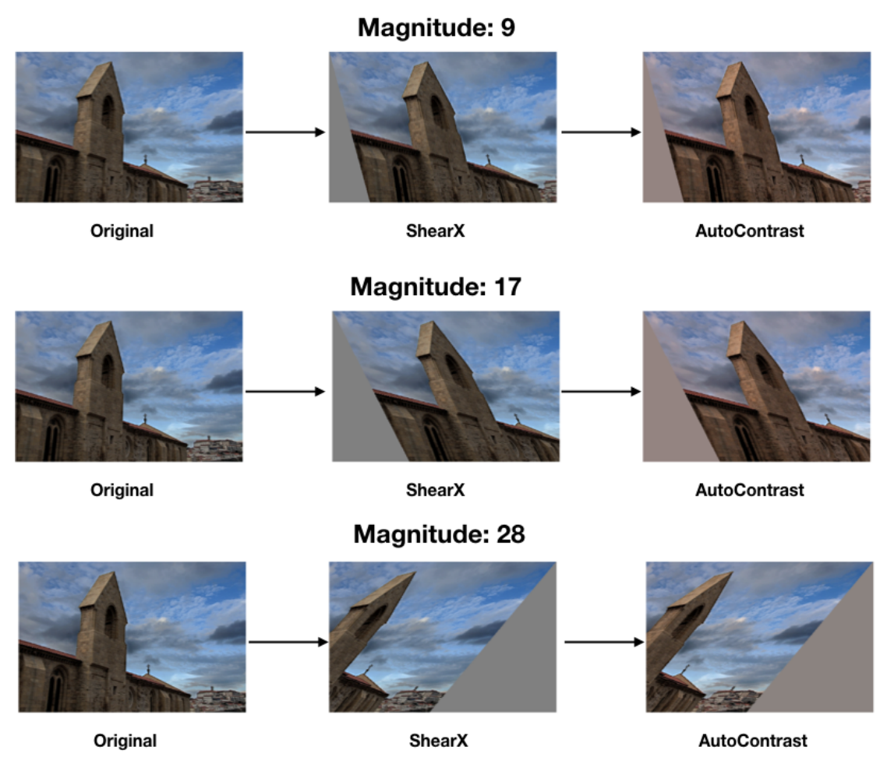

A performance comparison of RandAugment data augmentation between PyTorch and TensorFlow.

<!--more-->

[RandAugment](https://arxiv.org/pdf/1909.13719.pdf) has emerged as the de-facto standard data augmentation method in modern image classification research. The principle idea of RandAugment is to distort each training image by randomly applying augmentation functions from a set of 14 possible transformations, e.g., rotate, change brightness, translate, etc. Each individual function is itself random; for instance, the rotation function rotates the image by a randomly sampled degree.



This simplicity of RandAugment, combined with its ability to improve the validation accuracy of the trained models, is why RandAugment has been widely adopted.

### RandAugment implementation in PyTorch

The [torchvision](https://pytorch.org/vision/stable/index.html) package allows us to easily add RandAugment to our PyTorch dataloader pipeline with a single line of code:

```python
from torchvision.transforms import RandAugment

train_dataset = torchvision.datasets.ImageFolder(
    "path/to/data",
    transforms.Compose(
        [
            transforms.RandomResizedCrop(img_size),
            transforms.RandomHorizontalFlip(),
            RandAugment(num_ops=2, magnitude=10),
            transforms.ToTensor(),
            transforms.Normalize(
                mean=[0.485, 0.456, 0.406], std=[0.229, 0.224, 0.225]
            ),
        ]
    ),
)
```

### RandAugment implementation in TensorFlow

There are two commonly used implmentations of RandAugment in Tensorflow that are compatible with a TF 2.x `tf.data.Dataset` pipeline: One in the [tf-models-official](https://github.com/tensorflow/models) package and, more recently added, one in the [keras-cv](https://keras.io/api/keras_cv/layers/preprocessing/rand_augment/) package.

Both TensorFlow implementations can be added to our training pipeline using the standard `dataset.map` method:

```python
from official.vision.ops.augment import RandAugment
import keras_cv

train_dataset = # ... define dataset

# tf-models-official 
augmenter = RandAugment(num_layers=aug_layers, magnitude=10)
train_dataset = train_dataset.map(lambda x,y: (augmenter.distort(x),y), num_parallel_calls=tf.data.AUTOTUNE)

# keras-cv
augmenter = keras_cv.layers.RandAugment(value_range=(0, 255), augmentations_per_image=2)
train_dataset = train_dataset.map(lambda x,y: (augmenter(x),y), num_parallel_calls=tf.data.AUTOTUNE)

```

### Performance comparison

As the input pipeline can potentially bottleneck the training process, a natural question we want to answer is how fast these implementations are. In particular, one would hypothesize that the TensorFlow implementations might be faster due to its graph-mode execution model that tries to get rid of the slow single-threaded Python interpreter. Moreover, one would expect both TensorFlow implementations to perform on-par.

To test our hypothesis, I have set up ImageNet training pipelines based on all three implementations. The PyTorch pipeline simply uses the code snippet shown above, e.g., an `ImageFolder` dataset, whereas the TensorFlow pipelines are based on data stored in the [tfrecord format](https://www.kaggle.com/code/hmendonca/imagenet-1k-tfrecords-ilsvrc2012-tf2-helloworld).

To measure the dataloader speed we iterate over the dataset and keep track of the loading time of the most 50 most recent batches, i.e., to subtract a potential warmup phase.

```python
import numpy as np
import time

batch_size = 512
train_loader = get_trainloader(img_size=224, batch_size=batch_size, num_workers=24)
num_batches = 0
read_times = []
start_time = time.perf_counter()
prev_time = time.perf_counter()
MA_LEN = 50
for x, y in train_loader:
    num_batches += 1
    current_time = time.perf_counter()
    read_times.append(current_time - prev_time)
    total_time = current_time - start_time
    if len(read_times) > MA_LEN:
        read_times.pop(0)

    print(
        f"{num_batches} batches total in {batch_size*num_batches/total_time} images/s, last {MA_LEN}: {batch_size*len(read_times)/np.sum(read_times)} images/s"
    )
    prev_time = time.perf_counter()
    if num_batches >= 300:
        break

print(f"Loaded {num_batches} in {prev_time - start_time:0.2f} seconds")

```

I measured the number on an AMD Threadripper 3960X 24-Core processor machine with 256GB of memory. The data are stored on an M.2 SSD. For the PyTorch dataloader, I set with `num_workers=24`, and for the TensorFlow datasets I added `num_parallel_calls/num_parallel_reads=tf.data.AUTOTUNE` to the elementary operations on the dataset object.

| **Implementation**               | **Throughput** |
| -------------------------------- | -------------- |
| TensorFlow (no augmentation)     | ~4100 images/s |
| PyTorch (no augmentation)        | ~4500 images/s |
| torchvision (RandAugment)        | ~4300 images/s |
| keras-cv (RandAugment)           | ~1700 images/s |
| tf-models-official (RandAugment) | ~2600 images/s |

Both pipelines achieved roughly the same loading speed without data augmentation enabled. Quite surprisingly, the throughput of the torchvision dataloader is very little affected by the data augmentation method, i.e., a 5% reduction. Conversely, both TensorFlow pipelines significantly slowed down after adding RandAugment in the loader. Even more strangely, the `tf-models-official` implementation provides a more than 50% higher throughput than the `keras-cv` version.

Honestly, I have very few clues about where these inefficiencies of the TensorFlow pipelines originate. One option might be that the individual augmentation routines used by torchvision are much more efficiently implemented than the ones used in the TensorFlow RandAugment methods.

My key takeaway from this small experiment is that from now on, I will check the throughput of complex data pipelines more carefully, as the speed can be quite different from what to expect.
